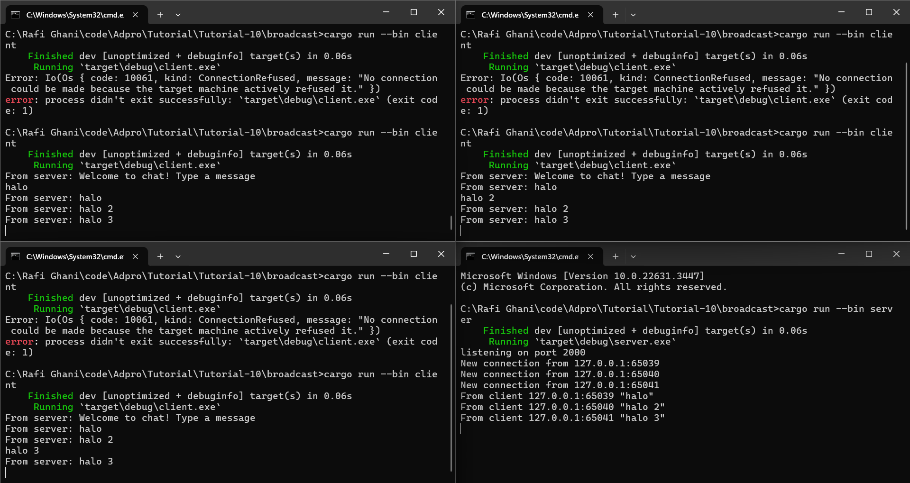

# TUTORIAL 10 (Broadcast Chat)
#### Rafi Ghani Harditama (2206081364)
#### ADPRO A / VRO

## Original code of broadcast chat

Dalam gambar tersebut, terlihat bahwa saya membuka empat terminal di mana salah satu terminal menjalankan perintah cargo run --bin server, sementara terminal lainnya menjalankan perintah cargo run --bin client. Setiap client mengirim pesan ke server, yang kemudian diterima dan dikirim kembali ke semua client.