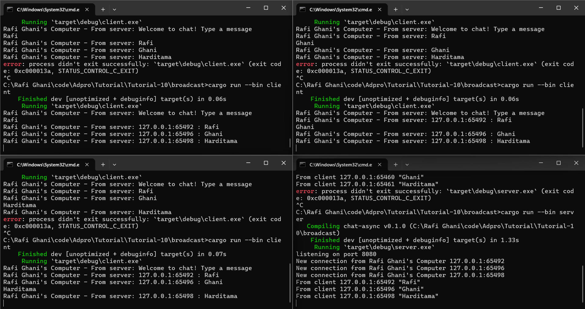

# TUTORIAL 10 (Broadcast Chat)
#### Rafi Ghani Harditama (2206081364)
#### ADPRO A / VRO

## Original code of broadcast chat

Dalam gambar tersebut, terlihat bahwa saya membuka empat terminal di mana salah satu terminal menjalankan perintah cargo `run --bin server`, sementara terminal lainnya menjalankan perintah `cargo run --bin client`. Setiap client mengirim pesan ke server, yang kemudian diterima dan dikirim kembali ke semua client.

## Modifying the websocket port

Dari gambar-gambar yang disajikan, terlihat bahwa program tetap berjalan dengan baik setelah port diubah menjadi 8080. Ini menunjukkan bahwa penggantian port tidak mempengaruhi fungsi komunikasi antara client dan server selama protokol yang digunakan tetap sama. Keduanya menggunakan protokol WebSocket yang dikelola oleh library tokio_websockets yang memastikan konsistensi dalam komunikasi. Meskipun port diubah, program tetap berjalan normal karena perubahan tersebut sudah direfleksikan dalam kode pada `client.rs` dan `server.rs.`

## Small changes. Add some information to client

Perubahan yang saya lakukan adalah pada `server.rs` dimana saya merubah kode `bcast_tx.send(text.into())?` menjadi `bcast_tx.send(format!("{addr} : {text}"))?;` dan `println!("New connection from {addr:?}")` menjadi `println!("New connection from Rafi Ghani's Computer {addr:?}");`. Selain itu pada `client.rs`, saya mengubah `println!("From server: {}", text)` menjadi `println!("Rafi Ghani's Computer - From server: {}", text)`